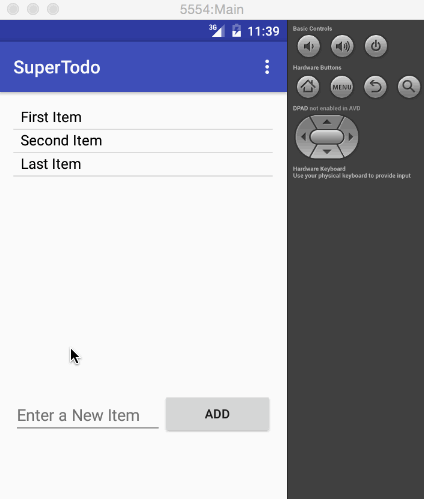

# SuperTodo
Enhanced To do list manager

This is an android demo application for managing the todo list.

Time Spent : 6 hours in total

Completed User Stories :

 * [x] Required: Can successfully add and remove items in the todo list
 * [x] Required: Includes support to Edit the Todos
 * [x] Required: Persists the Todos and retrieves it properly on app restarts
 * [x] Optional: Enhanced the list view by changing it to Swipe list view
 * [x] Optional: Have added Toast message while saving and Marking as Done.
 * [x] Optional: Added Classes for SQLlite implementation but because of time constraints havent hooked it up

Notes:

Spent some time for learning all the implementations, SQLLite, ORM, etc.

Walkthrough of all user stories:

GIF created with [LiceCap](http://www.cockos.com/licecap/).